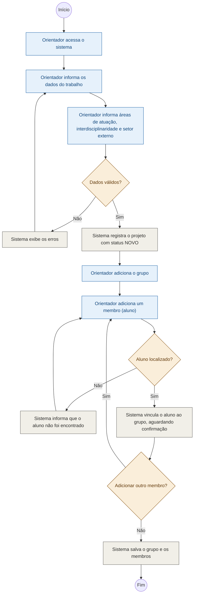
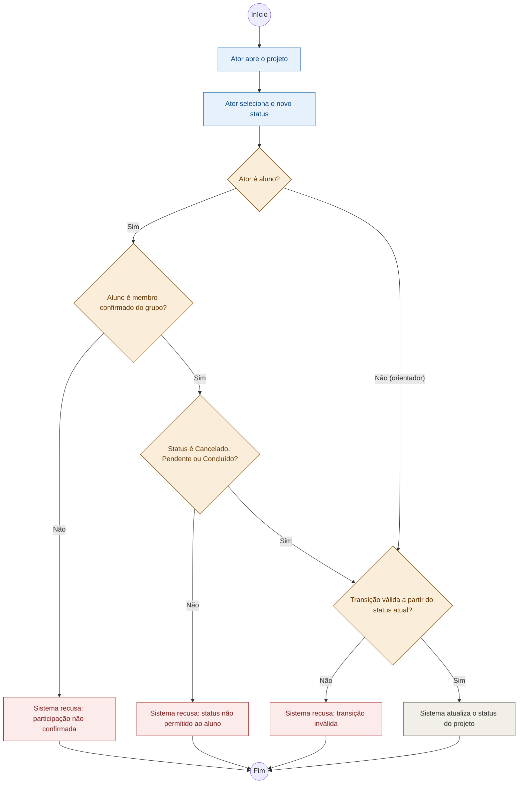
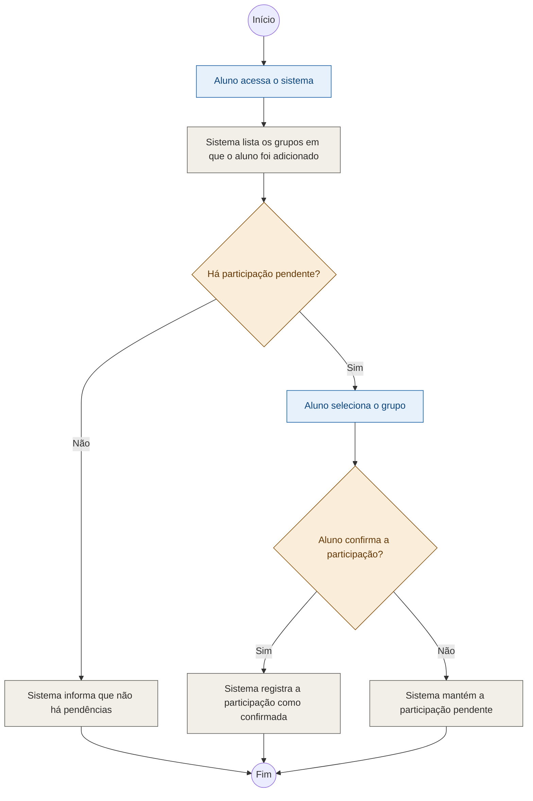
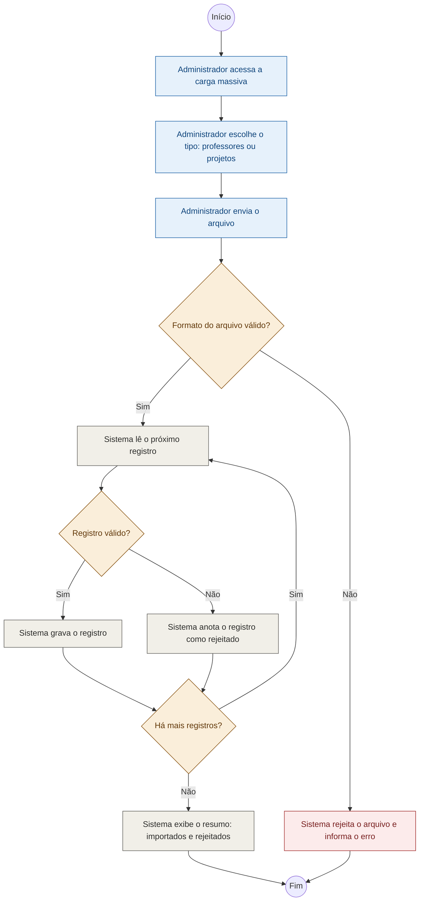

# Diagramas de Atividade: Módulo 2 Controle (Registro)

Legenda de cores: azul = ação do ator; cinza = ação do sistema; amarelo = decisão; vermelho = recusa/erro.

## 1. Registrar trabalho, grupo e membros

Ator: Orientador. Imagem: [01-registrar-trabalho-grupo-membros.png](01-registrar-trabalho-grupo-membros.png)

## 2. Realizar status (andamento)

Ator: Orientador e Aluno. Imagem: [02-realizar-status-andamento.png](02-realizar-status-andamento.png)

## 3. Confirmar participação no grupo

Ator: Aluno. Imagem: [03-confirmar-participacao-grupo.png](03-confirmar-participacao-grupo.png)

## 4. Carga massiva (professores ou projetos)

Ator: Administrador. Imagem: [04-carga-massiva.png](04-carga-massiva.png)

