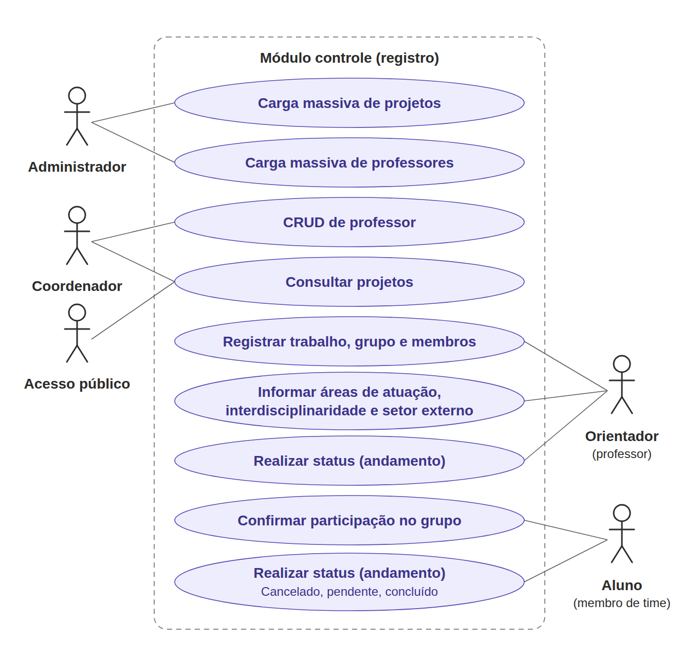

# Diagrama de Caso de Uso: Módulo 2 Controle (Registro)

Versão vetorial: [caso-de-uso.svg](caso-de-uso.svg)

## Atores

| Ator | Funcionalidades |
|---|---|
| Administrador | Carga massiva de professores; carga massiva de projetos |
| Coordenador | Cadastrar professores (CRUD); consultar projetos |
| Orientador (professor) | Cadastrar trabalhos (CRUD); informar áreas de atuação, interdisciplinaridade e setor externo; realizar todos os status (andamento) |
| Aluno (membro de time) | Confirmar participação no grupo (time); realizar status: Cancelado, Pendente, Concluído |
| Acesso público | Consulta de informações dos projetos |

## Fluxo resumido de uso

Orientador registra o projeto → informa áreas, interdisciplinaridade e setor externo → adiciona grupo e membros → alunos confirmam participação → orientador e alunos acompanham e realizam status → coordenador consulta os projetos (visão geral).
