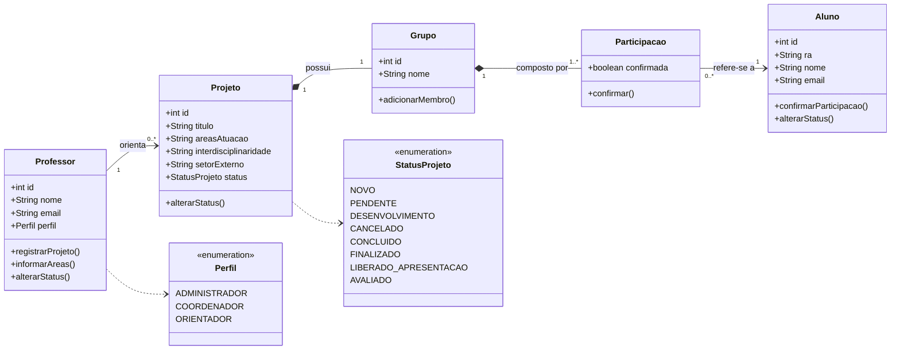

# Diagrama de Classes: Módulo 2 Controle (Registro)

Imagem: [diagrama-classes.png](diagrama-classes.png)

## Entidades

| Entidade | Papel no módulo |
|---|---|
| Projeto | Trabalho extensionista registrado pelo orientador, com áreas de atuação, interdisciplinaridade, setor externo e status |
| Professor | Orientador do projeto; o atributo perfil indica Administrador, Coordenador ou Orientador |
| Grupo | Time vinculado ao projeto |
| Aluno | Membro de time |
| Participacao | Vínculo entre aluno e grupo, com a confirmação de participação |

## Observação

Os atributos são uma primeira proposta e poderão ser refinados nas próximas etapas.
