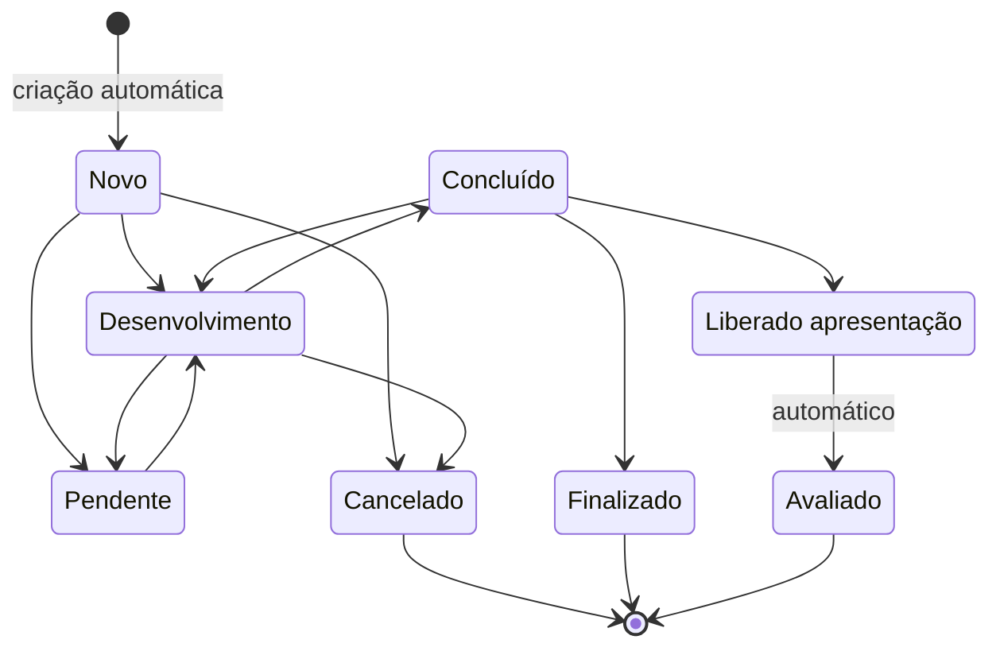

# Diagrama de Estados: Projeto (Módulo 2 Controle)

Imagem: [diagrama-estados.png](diagrama-estados.png)

## Estados finais

Cancelado, Finalizado e Avaliado.

## Quem realiza cada status

| Status | Quem realiza |
|---|---|
| Novo | Automático (criação do projeto) |
| Pendente | Orientador ou Aluno |
| Desenvolvimento | Orientador |
| Cancelado | Orientador ou Aluno |
| Concluído | Orientador ou Aluno |
| Finalizado | Orientador |
| Liberado apresentação | Orientador |
| Avaliado | Automático (após a avaliação na mostra) |

O orientador realiza todos os status; o aluno realiza apenas Cancelado, Pendente e Concluído.
